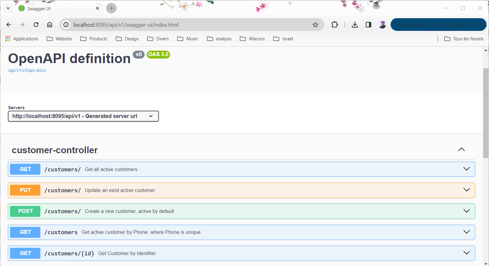

# Canal Plus Subscription System 

## Get Started 

Welcome to CanalPlus Customer Subscription Service. You can start by running the Spring Boot application proposing Rest endpoints to manage customers and Subscriptions.

To get familiar and test the Endpoints, check the Open Api documentation on [Swagger Page](http://localhost:8095/api/v1/)

Two different Rest Controllers are proposed with the different methods:
1. Customer Controller: 
    *  With GetById, GetByPhone (phone is unique), GetAll, 
    *  Create, Update
    *  Delete: : Disactivate customer and related subscriptions.  
    *  As enhancement, effective Delete  can be added for a specific Role (Admin)
2. Subscription controller:
    *  Get Allsubscription, get subsciption for a customer
    * create and update subscription
    * Disactivate subscription using the delete method

As shown in below figure, the customer reprensents a user that can create an account in Canal Plus portal. Subscription entity is the package the use want to purchase. 

Please note that :
* Customer can be identified by an Id generated by the microservice or using his Phone number which is unique in the system
* Once Cutomer disactivated, and created again, phone_active is a fild added to allow unique constraint(for all active users).

For simplicity, h2 embedded database is used in the application. You can access it on [H2 Page](http://localhost:8095/api/v1/h2-console) with [JDBC URL](jdbc:h2:file:/data/canalplus)

# System Description

## Microservices Components 
The microservice is based on Spring boot and contains different packages:
1. Controller: Contains Customers and Subscriptions containers
2. Service: Classes that adds validation and calls to repository
3. Repository: JPA Layer extended with JpaSpecificationExecutor<T> to build more complex Dynamic Queries
4. Model: Contains Entities, which were exposed to the Rest Calls. The best way is to have DTO classes to expose other that Entities.
5. Error: Handles Exception in a centralized way using ControllerAdvice

## Architecture
Development uses simple Architecture with Microservice exposing API. Depending on requirement, loads and processing time, other capabilities can be porposed.

# System Enhancement

## Architecture
Depending on requirements and upon system study, the architecture can be enhanced toward:
- Event Driven Architecture : Microservice can gt request by Events and send Events to continue the processing (Example handle Payment, Notify partners, Notify Customer by Email, ...)
- CQRS architectural pattern: For the subscription System, the number of writes (subscription creation), differs from the read (check customer and subscription). The architecture can be enhanced using CQRS architectural pattern. The separate of reads from writes enhance scalability and performance.

## Security 
It's important to secure the microservices using OAuth2 by setting Keyckloack as Authentication & Authorisation server.

## API Gateway
It's good practice to hide the internal micoservices by using an API gateway, that will handle other important aspect such as security, logging.. This will isolate the microservices from external calls and attacks.

## Database and Entities
In the project, H2 embedded database is used. It's possible to work with SQL databases, but for sake of flexibility using NoSQL databases can help in future changes of Tables schemas and attributes.

The entity is directly exposed through the rest Endpoints, which is not a good practice. To protect the database and not impact the Rest Contract, it's better to decouple the Table Entity from the returned POJO in the rest call.

Entities (Customer and Subscription) proposed in the project are quite simple: 
* It can be enriched with more attributes
* A better fields validation is required

The **active** field in both Customer and Subscription is a blocker and make queries more complex with a risk of database unconsistency:
* In the table Customer, a unicity constraint have been added to Phone and Active when Active = true. If Active is false, this constraint doesn't apply
* In the table Subscriptions, the unicity was harder to set up especially that it should include the subscription name, customer_fk and active if true.

                create table Customer(
                    id int, 
                    active boolean,
                    phone varchar(50),
                    phone_active varchar(50) as 
                    (case active when true then null else phone end) 
                    unique
                );

In order to simplify the process, and as Customer data is important and can be used for **Analytics** or **Commecial Actions**, it's good to:
* export this "deleted data" into another Collection/table 
* On delete, a notification can be sent to another service who handle that 
* remove the usage of active and delete the records (better performances and less sql/code complexity)

## Testing 
Not included in the code. Unit test, functional test should be part of the code. Integration and Robustess tests should also be automated

## CI/CD
For Integration and Deployment automation, CI/CD pipelines should be added.

## Observability 
KPI implementation and visualisation through Grafana gives good insight of the application health and performances.

